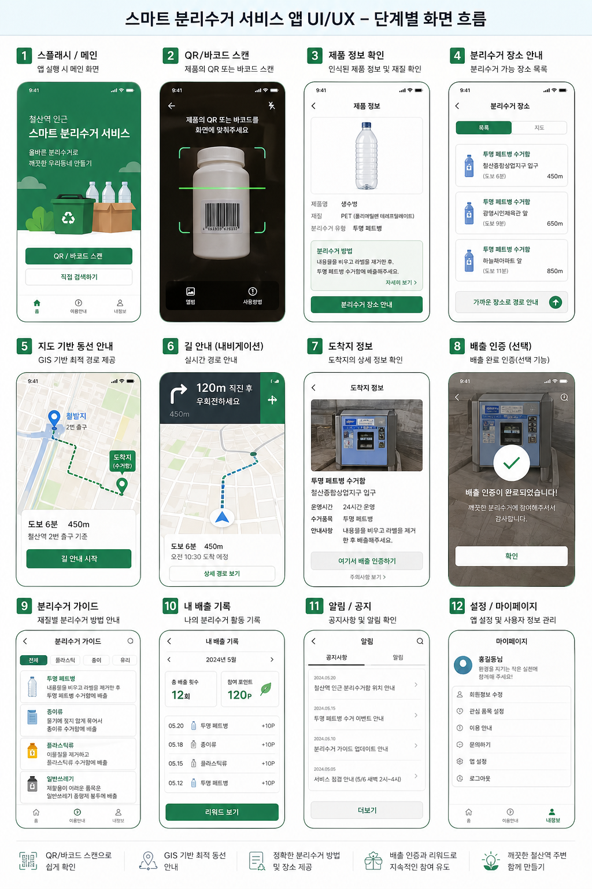
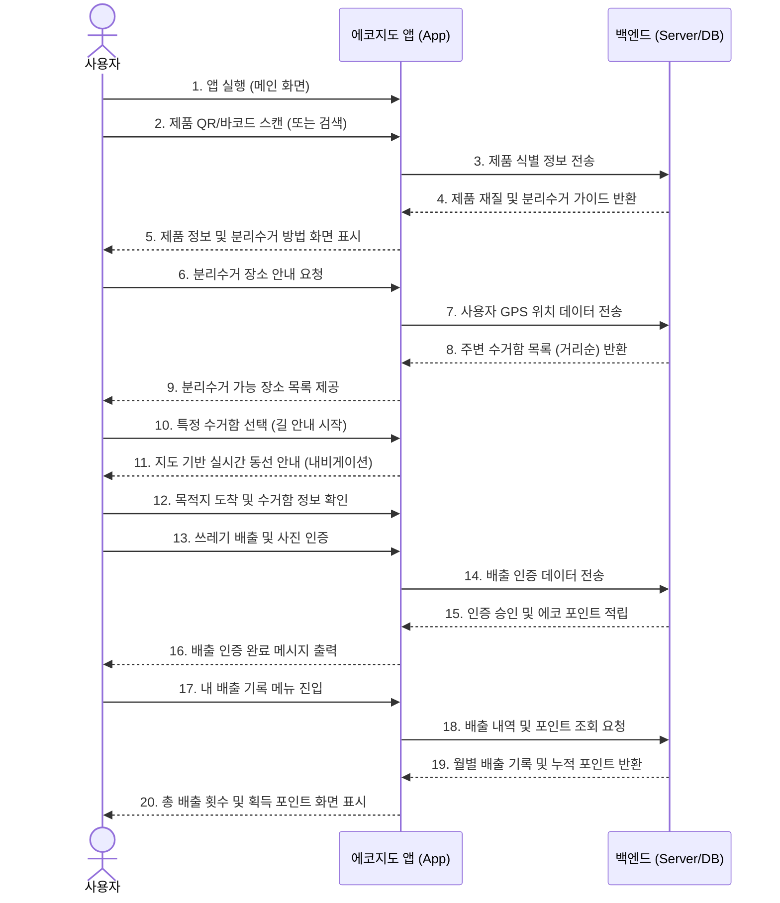
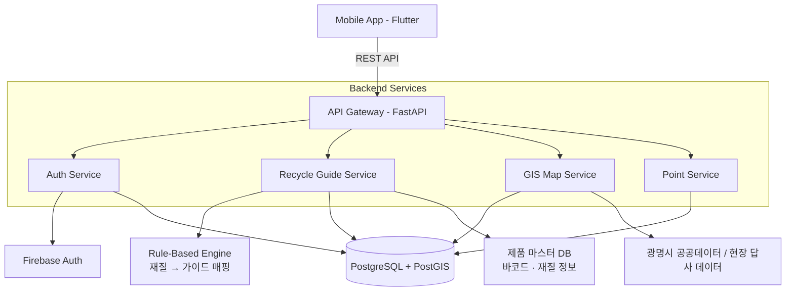
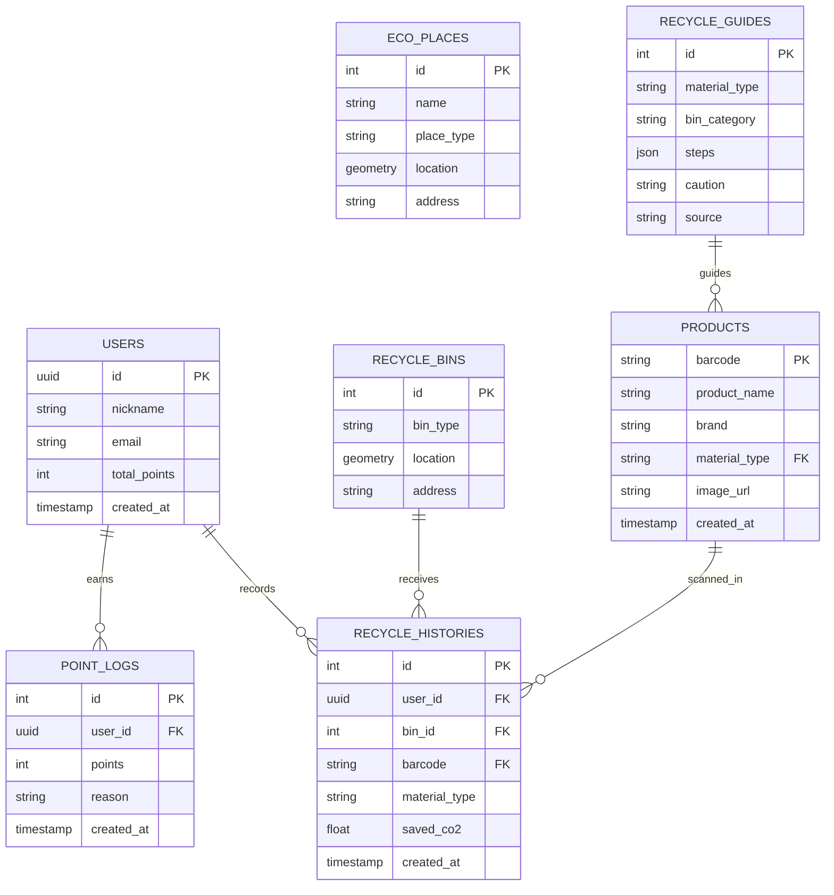

<div align="center">

<h1>에코지도 찌릿</h1>
<h3>EcoMap Jjirit</h3>

<p><strong>위치정보를 활용한 플라스틱 처리 AI 앱서비스</strong></p>
<p>2026 광명시 청년 생각펼침 공모사업 프로젝트</p>

<p>
  
  
  
  
  
</p>

</div>

---

## 프로젝트 개요

**에코지도 찌릿**은 사용자의 위치와 지역 환경 데이터를 기반으로 플라스틱 분리배출 방법, 가까운 재활용 수거함, 친환경 매장을 안내하는 환경 실천 서비스입니다.

사용자는 QR/바코드 스캔으로 제품을 식별하면, 등록된 제품 재질 정보를 기반으로 **결정론적 룰베이스 분리배출 가이드**를 제공합니다. 분리배출·텀블러 사용·친환경 매장 방문 같은 실천 활동을 기록해 환경 포인트와 랭킹으로 피드백을 받을 수 있습니다.

## 서비스 목표

> 광명시 청년과 시민이 일상 속에서 더 쉽게 분리배출하고, 친환경 장소를 찾고, 환경 실천을 지속하도록 돕는 지역 기반 ESG 플랫폼을 만든다.

**주요 사용자**

* 광명시 청년, 대학생, 자취생, 1인 가구
* 분리배출 방법이 헷갈리는 일반 시민
* 제로웨이스트 샵, 탄소중립 실천 매장 등 지역 친환경 비즈니스

**핵심 가치**

* 위치 기반으로 가까운 환경 시설을 빠르게 안내
* 플라스틱 제품별 분리배출 방법을 쉽게 제공
* 환경 실천을 포인트, 랭킹, 리포트로 시각화
* 공공데이터와 현장 데이터를 연결해 지역 ESG 활동 기반 구축

---

## 핵심 기능

### 바코드 기반 룰베이스 분리배출 가이드

스마트폰 카메라로 제품의 QR/바코드를 스캔하면 서버에 등록된 제품 마스터 DB에서 **재질(PET, HDPE, PP, 종이, 유리 등)을 조회**합니다. 재질이 특정되면 환경부·지자체 분리배출 표시 규정에 따라 미리 정의된 **룰베이스 가이드라인**(라벨 제거, 내용물 비우기, 압착 여부 등)을 즉시 제공합니다.

* AI 추론 단계가 없어 응답이 빠르고 결정론적으로 동작
* 환경부/지자체 가이드 변경 시 DB(`RECYCLE_GUIDES`)만 갱신하면 즉시 반영
* 미등록 바코드는 사용자가 재질을 직접 선택하면 동일한 룰베이스 가이드를 제공하는 fallback 플로우 운영

### 위치 기반 에코 지도

사용자 현재 위치를 기준으로 광명시 내 재활용 수거함, 쓰레기통, 제로웨이스트 샵, 탄소중립 실천 매장을 지도에 표시합니다. 장소 상세 정보, 거리, 이동 경로, 배출 가능 품목을 함께 제공합니다.

### 환경 포인트와 랭킹

분리배출 인증, 텀블러 사용, 친환경 매장 방문 등 사용자의 실천 활동을 기록합니다. 누적 기록을 기반으로 환경 포인트, 개인 리포트, 사용자/지역별 랭킹을 제공합니다.

### 데이터 기반 운영

공공데이터, 현장 답사 데이터, 사용자 실천 데이터를 DB에 누적합니다. 향후 광명시 ESG 정책 제안, 친환경 매장 협업, 서비스 고도화를 위한 분석 기반으로 활용할 수 있게 설계합니다.

---

## 화면 구성

스마트 분리수거 서비스 앱의 단계별 화면 흐름입니다.

<div align="center">
  
</div>

| 단계 | 화면 | 설명 |
|:----:|:----|:----|
| 1 | 스플래시 / 메인 | 앱 실행 시 진입 화면 |
| 2 | QR / 바코드 스캔 | 제품의 QR 또는 바코드를 스캔 |
| 3 | 제품 정보 확인 | 인식된 제품 정보 및 재질(예: PET) 확인 |
| 4 | 분리수거 장소 안내 | 분리수거 가능 장소 목록 (거리순) |
| 5 | 지도 기반 동선 안내 | GIS 기반 최적 경로 제공 |
| 6 | 길 안내 (내비게이션) | 실시간 경로 안내 |
| 7 | 도착지 정보 | 수거함 운영시간·수거품목·안내사항 확인 |
| 8 | 배출 인증 (선택) | 사진 촬영 후 배출 완료 인증 |
| 9 | 분리수거 가이드 | 재질별 룰베이스 분리수거 방법 안내 |
| 10 | 내 배출 기록 | 월별 배출 횟수 및 적립 포인트 기록 |
| 11 | 알림 / 공지 | 공지사항 및 알림 확인 |
| 12 | 설정 / 마이페이지 | 앱 설정 및 사용자 정보 관리 |

---

## 사용자 시나리오 (Sequence Diagram)



> **핵심 포인트(3~4단계):** 제품 식별은 바코드만으로 결정론적으로 이루어지며, 서버는 등록된 제품 재질에 매칭된 **룰베이스 가이드**를 즉시 반환합니다. 별도의 AI 추론 단계가 없어 응답 속도와 정확도가 모두 보장됩니다.

---

## 내가 맡을 개발 범위

기획 자료 기준 개발 파트의 핵심 목표는 **광명시 친환경 데이터를 지도에서 탐색하고, 플라스틱 분리배출 방법을 안내하며, 사용자의 환경 실천을 포인트/랭킹으로 기록하는 프로토타입**을 만드는 것입니다.

### MVP 구현 우선순위

1. **지도 기반 장소 탐색**
   * 광명시 재활용 수거함, 쓰레기통, 제로웨이스트 샵, 탄소중립 실천 매장 데이터 수집/정제
   * 사용자 위치 기준 가까운 장소 표시
   * 장소 상세 정보, 배출 가능 품목, 이동 경로 제공
   * 공공데이터가 부족할 경우 현장 답사 데이터 또는 수동 등록 데이터 활용

2. **바코드 기반 분리배출 인식 및 가이드**
   * QR/바코드 스캔으로 제품 식별 (`PRODUCTS` 테이블 조회)
   * 식별된 제품의 재질(`material_type`)을 기반으로 룰베이스 가이드 매칭 (`RECYCLE_GUIDES` 테이블)
   * 라벨 제거, 내용물 비우기, 압착 등 단계별 분리배출 액션 제공
   * 미등록 바코드인 경우 사용자가 직접 재질을 선택하면 동일한 룰베이스 가이드 제공
   * 환경부/지자체 가이드 변경 시 `RECYCLE_GUIDES` 테이블만 갱신

3. **환경 실천 기록과 보상**
   * 분리배출 인증, 텀블러 사용, 친환경 매장 방문 기록
   * 환경 포인트 적립
   * 개인 리포트와 사용자/지역 랭킹 제공
   * 실제 제휴 전까지 내부 테스트용 포인트 정책으로 운영

4. **백엔드와 데이터 관리**
   * 사용자, 장소, 분리배출 가이드, 인증 기록, 포인트 API 개발
   * PostgreSQL/PostGIS 기반 위치 검색과 거리 계산
   * 운영자가 장소/수거함 데이터를 등록·수정할 수 있는 관리 API 준비

5. **배포와 운영 기반**
   * Docker 기반 개발/배포 환경 구성
   * 클라우드 서버에서 프로토타입 실행
   * 지도 SDK, 공공데이터 API 키 등 민감 정보 환경 변수 분리
   * 테스트 데이터와 실제 수집 데이터 분리

### 개발 산출물

* **Flutter 앱:** 지도, 장소 상세, QR/바코드 스캔, 분리배출 안내, 실천 인증, 포인트/랭킹, 개인 리포트
* **FastAPI 서버:** 인증 연동, 장소 검색, 분리배출 가이드, 실천 기록, 포인트 적립, 랭킹 조회 API
* **데이터베이스:** 사용자, 친환경 장소/수거함, 제품/재질 정보, 실천 기록, 포인트 로그, 랭킹 집계 테이블
* **데이터 파이프라인:** 공공데이터와 현장 답사 데이터를 정제해 DB에 적재하는 스크립트
* **인식·가이드 엔진:** QR/바코드 기반 제품 식별 + 재질별 룰베이스 가이드 매칭 엔진 (조건문/JSON 룰셋 기반, 확장 가능한 구조)

### 개발 시 먼저 결정할 것

* 지도 SDK는 Naver Maps, Kakao Maps, Google Maps 중 비용, 상업 이용 조건, Flutter 지원 상태를 비교해 결정
* 제품 마스터 DB 확보 방안 결정: 식약처/환경부 공공데이터, GS1 Korea 연동, 자체 크롤링 중 우선순위
* 미등록 바코드 fallback 정책: 사용자 수동 재질 선택 → 운영자 검수 후 DB 등록 플로우 설계
* 포인트는 실제 현금성 보상 전까지 서비스 내부 포인트로 운영
* 위치정보와 인증 이미지를 다루므로 개인정보 수집 동의, 보관 기간, 삭제 정책 포함

---

## 시스템 아키텍처



## 데이터베이스 구조



---

## 기술 스택

**Frontend**

* Flutter
* Riverpod
* Naver Maps / Kakao Maps / Google Maps SDK 후보

**Backend**

* Python
* FastAPI
* SQLAlchemy

**Database**

* PostgreSQL
* PostGIS

**인식 · 가이드 엔진**

* QR / 바코드 스캔 (Flutter `mobile_scanner` 등)
* 룰베이스 가이드 엔진 (재질 → 분리배출 액션 매핑)
* 제품 마스터 DB 기반 결정론적 추론 (별도 ML 모델 미사용)

**Infra**

* Docker
* AWS EC2 / S3 / RDS
* GitHub Actions

**Authentication**

* Firebase Authentication

---

## 설치 및 실행

### 1. Repository 클론

```bash
git clone https://github.com/your-username/eco-map-jjirit.git
cd eco-map-jjirit
```

### 2. 백엔드 실행

```bash
cd backend
python -m venv venv
source venv/bin/activate  # Windows: venv\Scripts\activate
pip install -r requirements.txt

cp .env.example .env
uvicorn app.main:app --reload --host 0.0.0.0 --port 8000
```

### 3. 프론트엔드 실행

```bash
cd frontend
flutter pub get
flutter run
```

---

## 개발 일정

**2026년 4월**

광명시 친환경 매장 리스트업, 유사 서비스 벤치마킹, 현장 답사

**2026년 5월**

기능 명세서 확정, UI/UX 설계, 지도 SDK 검토, 장소/수거함 DB 구조 설계

**2026년 6월**

지도 API 연동, 백엔드 API 개발, 클라우드 서버 환경 구축, 핵심 기능 테스트

**2026년 7월**

프로토타입 1차 제작, 분리배출 가이드와 포인트 기능 연결, 사용자 테스트 준비

**2026년 8월**

피드백 기반 지도 UI 개선, 버그 수정, 실천 기록/랭킹 고도화

**2026년 9~10월**

최종 버전 안정화, 활동 성과 정리용 데이터 리포트 생성, 배포/시연 준비

---

## 팀

**팀명:** 찌릿

**구성**

* 김현준: 팀장 / 총괄
* 김성연: 팀원
* 권민재: 팀원

---

## 라이선스

이 프로젝트는 MIT 라이선스에 따라 배포됩니다.
