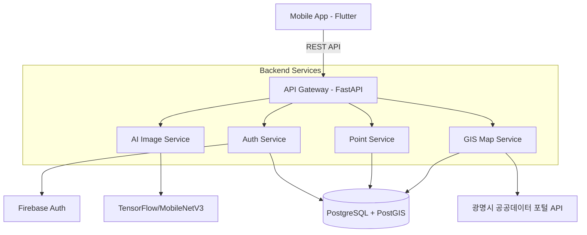

# ecomap
# 에코지도 찌릿 (EcoMap Jjirit)

> **"위치정보를 활용한 플라스틱 처리 AI 앱서비스"**[cite: 1]  
> 2026 광명시 청년 생각펼침 공모사업 프로젝트

---

## 프로젝트 개요
'에코지도 찌릿'은 헷갈리는 복합 재질 플라스틱의 정확한 분리배출 방법을 AI 객체 인식을 통해 실시간으로 안내하고, 사용자 위치를 기반으로 광명시 내 가장 가까운 재활용 수거함을 매핑해주는 서비스입니다[cite: 1]. 올바른 분리배출 실천 시 '환경 포인트'를 지급하여 대학생, 청년, 1인 가구의 지속적인 환경 보호 활동을 장려합니다[cite: 1, 2].

---

## 핵심 기능 (Key Features)

### 1. AI 지능형 분리배출 가이드
* **객체 인식 및 재질 분류:** 스마트폰 카메라로 플라스틱 용기를 스캔(QR/바코드/이미지)하면 AI가 재질을 자동 분류합니다[cite: 1].
* **맞춤형 행동 지침:** 개인화된 맞춤 플라스틱 폐기물 처리 방법(AI 큐레이션)을 제공합니다[cite: 1].

### 2. 위치 기반 에코 지도 (GIS Mapping)
* **실시간 수거함 위치 조회:** 광명시 공공데이터를 연동하여 지역별 쓰레기통 및 수거함 위치를 지도 상에 매칭합니다[cite: 1].
* **친환경 로컬 데이터 연결:** 지역 내 제로웨이스트 샵 및 탄소중립 실천 매장을 안내합니다.

### 3. 에코 포인트 & 게이미피케이션
* **리워드 시스템:** 텀블러 이용, 분리배출 인증 시 실천 포인트 적립 및 혜택을 제공합니다[cite: 1].
* **실천 랭킹:** 사용자별/지역별 환경 실천 랭킹 및 보상 체계를 지원합니다[cite: 1].

---

## 시스템 아키텍처 (Architecture)

## 데이터베이스 구조 (ERD)
코드 스니펫
erDiagram
    USERS {
        uuid id PK
        string nickname
        string email
        int total_points
        timestamp created_at
    }
    RECYCLE_BINS {
        int id PK
        string bin_type "플라스틱, 캔, 일반 등"
        geometry location "PostGIS Point"
        string address
    }
    RECYCLE_HISTORIES {
        int id PK
        uuid user_id FK
        int bin_id FK
        string plastic_type
        float saved_co2
        timestamp created_at
    }
    POINT_LOGS {
        int id PK
        uuid user_id FK
        int points
        string reason
        timestamp created_at
    }

    USERS ||--o{ RECYCLE_HISTORIES : "has"
    USERS ||--o{ POINT_LOGS : "earns"
    RECYCLE_BINS ||--o{ RECYCLE_HISTORIES : "receives"

## 기술 스택 (Tech Stack)
Frontend: Flutter, Riverpod, Naver/Google Maps SDK

Backend: Python, FastAPI, SQLAlchemy

Database: PostgreSQL, PostGIS (for spatial queries)

AI / ML: TensorFlow, PyTorch

Infra: AWS (EC2, S3, RDS), GitHub Actions, Docker

Authentication: Firebase Authentication

## 설치 및 실행 방법 (Getting Started)
1. Repository 클론
Bash
git clone [https://github.com/your-username/eco-map-jjirit.git](https://github.com/your-username/eco-map-jjirit.git)
cd eco-map-jjirit
2. 백엔드 (FastAPI) 설정 및 실행
Bash
cd backend
python -m venv venv
source venv/bin/activate  # Windows: venv\Scripts\activate
pip install -r requirements.txt

cp .env.example .env
uvicorn app.main:app --reload --host 0.0.0.0 --port 8000
3. 프론트엔드 (Flutter) 설정 및 실행
Bash
cd frontend
flutter pub get
flutter run

## 프로젝트 팀 및 일정
팀명: 찌릿 (Jjirit)

  

팀장: 김현준 (총괄)  

팀원: 김성연  

팀원: 권민재  

개발 마일스톤 (2026년)

  

4월: 광명시 친환경 매장 리스트업, 기능 명세서 및 UI/UX 설계, GIS 멘토링  

5월: DB 구조 설계, 지도 API 연동 및 핵심 기능 개발  

6월: 클라우드 서버 구축, 백엔드 테스트, 프로토타입 1차 제작  

7~8월: 피드백 수렴, UI/UX 개선 및 버그 수정, 앱 홍보[cite: 2]

9~10월: 에코지도 최종 버전 완성, 모임 활동 성과 정리 및 공유[cite: 2]

라이선스 (License)
이 프로젝트는 MIT 라이선스에 따라 배포됩니다.
