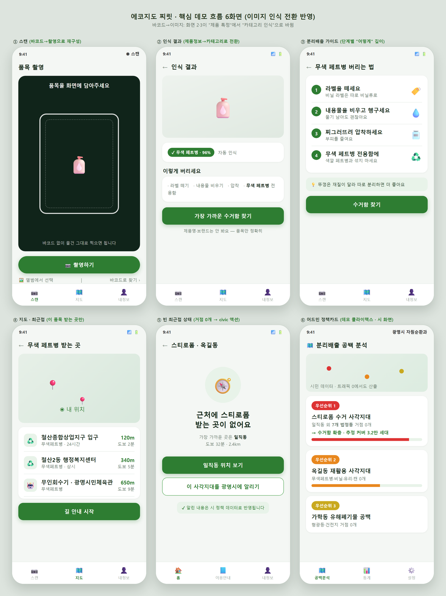
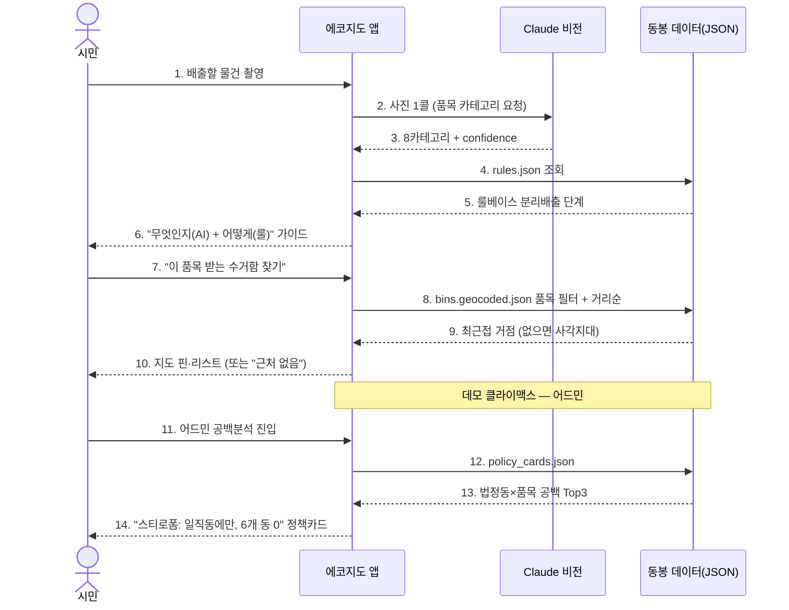
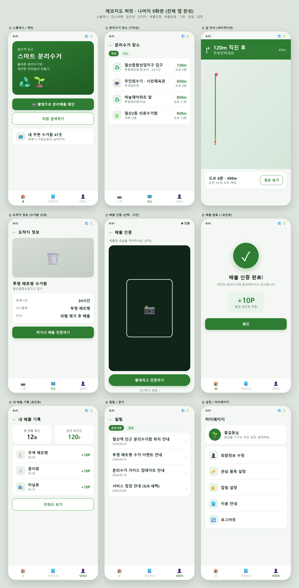
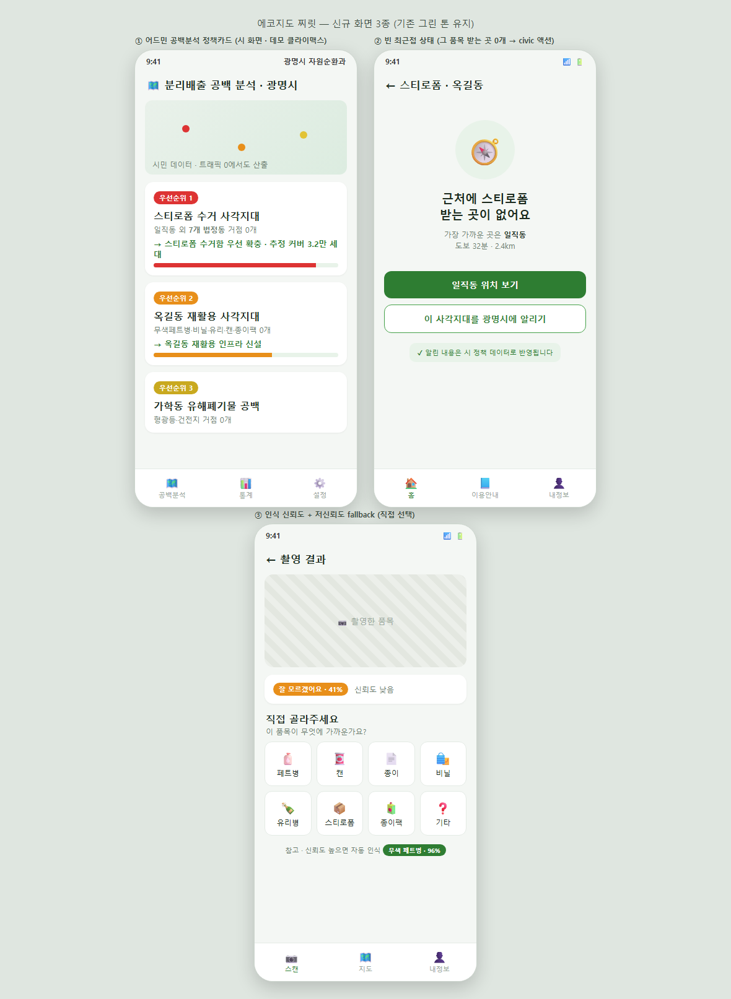
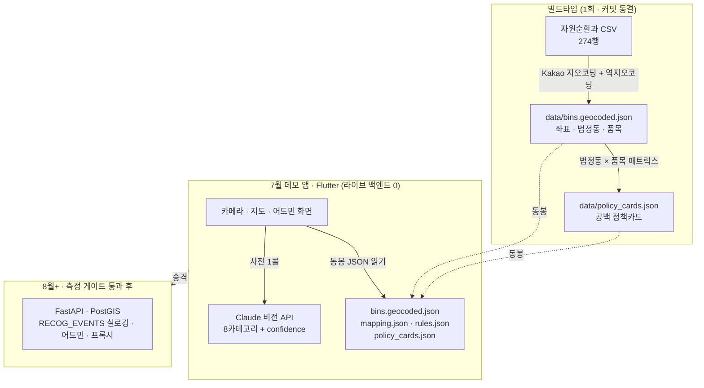
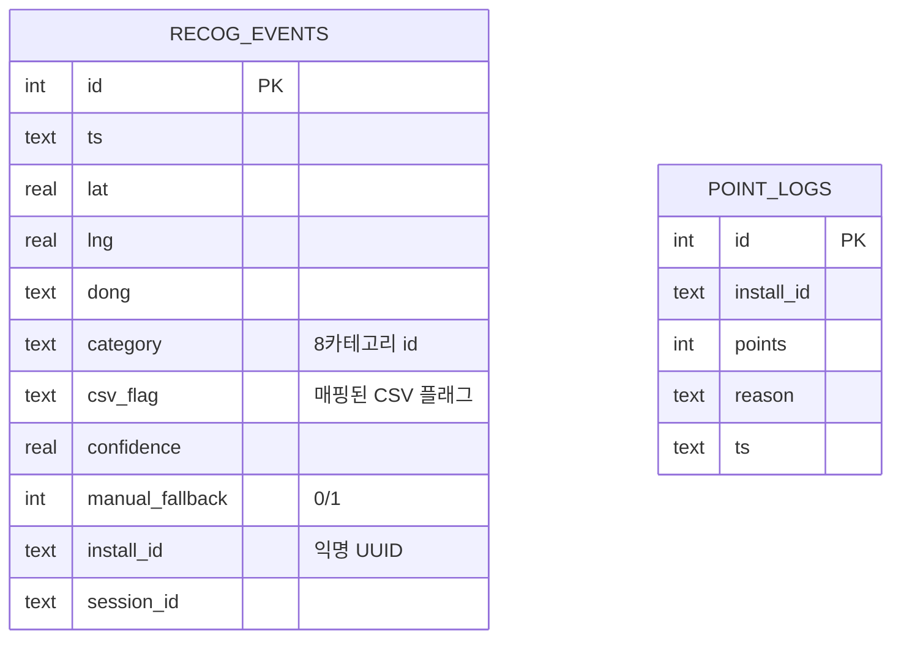

<div align="center">


<h1>에코지도 찌릿</h1>
<h3>EcoMap Jjirit</h3>

<p><strong>사진으로 확인하는 분리배출 · 품목별 수거함 지도 · 시(市) 공백분석</strong></p>
<p>2026 광명시 청년 생각펼침 공모사업 프로젝트</p>

<p>
  
  
  
  
  
  
</p>

</div>

---

## 한 줄 소개

> **AI는 "무엇인지"를 알려주고, 룰은 "어떻게 버리는지"를 정한다.**
> 사진 한 장으로 분리배출법을 안내하고, 그 품목을 받는 **가장 가까운 수거함**을 광명시 실데이터로 찾아주며,
> 시민의 사용 기록을 모아 **광명시가 어디에 무엇이 부족한지(수거 공백)** 를 짚어 주는 civic 도구.

**에코지도 찌릿**은 상업 서비스가 아니라 **공모전 출품작**입니다. 평가 기준은 매출이 아니라 심사위원(시 공무원) 임팩트 · 실사용 가능성 · 공모 취지 적합성 · 4~10월 일정 내 데모입니다.

## 누구를 위한 것인가 (리프레임)

기획 초기에는 "시민을 분리배출에 빠지게 하는 앱"을 목표했지만, 팀 스스로 **"시민이 이 앱을 쓸 강력한 동인은 아직 약하다"** 는 점을 정직하게 인정했습니다. 그래서 방향을 바꿨습니다.

| | 기존(구 설계) | 현재(리프레임) |
|---|---|---|
| **핵심 고객** | 개인 시민 (B2C) | **광명시 자원순환과 (B2G)** |
| **헤드라인** | 바코드 스캔 → 재질 조회 | **이미지 인식 가이드 + 품목별 수거함 지도 + 공백분석** |
| **시민의 역할** | 사용 동인(약함) | **데이터 생성원** — 쓰는 만큼 시 정책 데이터가 쌓임 |
| **바코드** | 핵심 기능 | **데모용으로 강등** (한국에 공개 바코드→재질 DB 없음) |

시민에겐 **"이거 어떻게 버리지?"** 를 즉시 푸는 실용을 주고, 시엔 그 사용에서 나오는 **수거 인프라 공백 지도**를 줍니다.

## 전략 — "마지막 30미터"

경기도 **기후행동 기회소득**(약 200만 명 대상, 텀블러·자전거·분리배출까지 보상)과 **넓이로 경쟁하지 않습니다.** 제도는 경쟁자가 아니라 **보완재이자 배경 근거**입니다.

우리는 제도가 못 푸는 **"분리배출을 정확히 어디에·어떻게"** 라는 마지막 30미터를 광명시 실데이터로 좁게·깊게 풉니다. 실보상(탄소중립포인트·광명사랑화폐) 연계는 로드맵으로 두되, "공식 인증 채널"을 참칭하지 않고 **"광명시 특화 분리배출 인증·데이터 파일럿 제안"** 수준까지만 주장합니다.

---

## 핵심 기능 (3축)

### 1. 이미지 인식 분리배출 가이드

카메라로 배출할 물건을 찍으면 **Claude 비전**이 **8개 품목 카테고리**(무색페트병·캔/고철·종이·비닐·유리병·스티로폼·종이팩·기타)와 신뢰도를 반환합니다. 카테고리가 정해지면 **결정론적 룰베이스 가이드**(라벨 떼기·헹구기·압착 등)를 즉시 보여 줍니다.

* **AI는 분류만, 배출법은 룰이 결정** — 응답이 빠르고 근거가 명확
* 신뢰도 < 0.7이면 **8품목 수동 선택 fallback** (크래시·빈화면 없음)
* 환경부/광명시 가이드 변경 시 `shared/rules.json`만 갱신
* 제품명·브랜드는 표시하지 않음 (재질 DB 참칭 방지)

### 2. 품목별 수거함 지도

광명시 자원순환과가 제공한 **실 수거함 데이터 274개**를 지오코딩해, **인식한 품목을 실제로 받는 거점만** 필터링하고 사용자 위치 기준 거리순으로 안내합니다.

* 품목 Y/N 커버리지로 필터 → 거리순 정렬 → 최근접 핀·리스트
* **거점이 0개인 사각지대**(예: 특정 동의 스티로폼)는 숨기지 않고 *"근처에 없음 + 가장 가까운 동 + 이 사각지대를 광명시에 알리기"* 로 안내

### 3. 시(市) 수거 공백분석 정책카드 — 데모 클라이맥스

동결된 수거함 데이터의 **법정동 × 품목 매트릭스**에서 *"Y 거점이 0인 칸"* = 정책 후보를 자동 산출합니다. 시민 트래픽이 0이어도 **오늘 있는 공공데이터만으로** 정책 근거가 나옵니다.

> 실데이터 검증 예: **스티로폼 수거 거점은 일직동에만 4곳**, 나머지 6개 법정동(하안·소하·가학·광명·철산·옥길)은 **0곳**.

---

## 데모 흐름

<div align="center">
  
</div>



## 화면 구성

핵심 데모 6화면 + 보조 화면으로 구성한 **프로토타입**입니다 (풀 서비스 아님).

| # | 화면 | 설명 |
|:--:|:--|:--|
| 1 | 스캔 (카메라) | 배출할 물건을 촬영 |
| 2 | 인식 결과 | 8카테고리 배지 + 가이드 미리보기 + "수거함 찾기" |
| 3 | 분리배출 가이드 | 카테고리별 룰베이스 단계·주의사항 |
| 4 | 수거함 지도 | 해당 품목 받는 거점만 거리순 핀·리스트 |
| 5 | 사각지대(빈 상태) | 거점 0개 → 가장 가까운 동 안내 + 시에 알리기 |
| 6 | **어드민 공백분석** | 법정동×품목 공백 정책카드 Top3 (클라이맥스) |

<div align="center">
  
  <br/><br/>
  
</div>

> 포인트·랭킹·실천 기록 화면은 **삭제가 아니라 로드맵**입니다. 인식 효용(Hook)으로 사용을 유도하고, **측정 게이트를 통과한 뒤** 포인트/랭킹을 단계적으로 도입, 실보상 연계는 그다음입니다.

---

## 아키텍처

**7월 데모의 원칙: 라이브 백엔드 0.** 지도·최근접·공백분석은 전부 **빌드타임에 JSON으로 precompute**해 앱에 동봉합니다. 274행 최근접은 클라이언트 distance sort로 충분(데모에 PostGIS 불필요). FastAPI/PostGIS 척추는 실사용 로깅이 시작되는 **8월**로 미룹니다.



### 데이터 계약 (단일 소스)

앱과 빌드 스크립트가 **공유**하는 파일. 양쪽에 중복 정의 금지.

| 파일 | 역할 |
|---|---|
| `shared/mapping.json` | 인식 8카테고리 ↔ CSV 15플래그 매핑 (역매핑 유일성 보장) |
| `shared/rules.json` | 카테고리 → 배출 단계·주의사항 (환경부/광명시 가이드 인용) |
| `data/bins.geocoded.json` | 지오코딩 동결 산출물 (좌표·법정동·행정동·품목 Y/N) |
| `data/policy_cards.json` | 공백분석 정책카드 (법정동×품목 산출) |

### 데이터 모델 (앱 로컬 SQLite · 8월 PostGIS 이관)



> 데모에서 `RECOG_EVENTS`는 로컬/시드, `POINT_LOGS`는 **테이블만 생성**(적립 로직·UI는 측정 게이트 후). install-id는 앱 첫 실행 시 생성하는 익명 UUID로, 개인정보 없이 사용 패턴만 집계합니다.

---

## 데이터: 광명시 자원순환과 CSV → 지오코딩 동결

프로젝트의 데이터 척추. 자원순환과 제공 CSV(수거함 **274행**, 좌표 없음, 도로명 259 / 지번 15)를 **빌드타임 1회** Kakao로 지오코딩해 좌표 + **역지오코딩 법정동/행정동** + 15품목 플래그로 동결합니다. 런타임 지오코딩은 금지 — 앱은 동결 JSON만 읽습니다.

**현재 상태 (T1 완료, 2026-07-03):**

| 지표 | 값 |
|---|---|
| 총 수거함 | 274행 (270 ok / 4 manual / 0 failed) |
| 좌표 채움률 | **100%** |
| 법정동 채움률 | **100%** |
| 검증 | 전 좌표 라이브 Kakao 역지오코딩 재검증 (독립 감사) |

Kakao가 못 잡은 3주소는 원본 CSV의 랜드마크(공원·복지회관)를 키워드 검색해 보정하고, **광명시 좌표 봉투 밖 값은 빌드를 중단**시키는 sanity 가드로 오배정을 차단합니다. 자세한 사용법은 [`scripts/geocode/README.md`](scripts/geocode/README.md) 참고.

---

## 기술 스택

**Frontend** · Flutter · Riverpod · **Kakao Maps SDK**

**인식 · 가이드 엔진** · **Claude 비전**(사진 → 8카테고리 + confidence, 구조화 출력) · 룰베이스 가이드 엔진(`shared/rules.json`) · 결정론적 배출법 매핑

**데이터 파이프라인** · Python · **Kakao Local API**(주소→좌표, 좌표→법정동/행정동) · 빌드타임 precompute → JSON 동결

**Backend (8월+)** · FastAPI · SQLAlchemy · PostgreSQL + PostGIS *(7월 데모에는 미사용)*

**Infra** · Docker · GitHub Actions · GitHub Releases(APK 배포)

> 멀티모달 API 키는 데모 시 앱 임베드(통제·데모 후 로테이트), 실사용 배포 APK에는 노출 금지 → **8월 프록시** 뒤로 이관.

---

## 구현 태스크 (T1~T10)

7월 프로토타입 범위. 상세 명세·수용기준은 [`SPEC.md`](SPEC.md).

```
T1 지오코딩 ─┬─> T3 공백분석 ──> T8 어드민 정책카드(클라이맥스)
             ├─> T6 최근접(좌표)
T2 검증게이트 ┘

T4 매핑 단일소스 ──> T5 인식 플로우 ──> T6 최근접 ──> T7 이벤트로깅
                                    └─> T9 eval
T10 데모각본 (T5·T8 후 마지막)
```

| ID | 태스크 | 상태 |
|---|---|:--:|
| **T1** | geocode-pipeline — CSV 지오코딩 동결 (단일 실패점) | ✅ 완료 |
| T2 | geocode-verify — 매칭률·행정동 게이트 | ⬜ |
| T3 | gap-analysis — 법정동×품목 공백 → 정책카드 | ⬜ |
| T4 | mapping-single-source — `shared/mapping.json`·`rules.json` | ⬜ (키 불필요) |
| T5 | recognition-flow — Claude 비전 인식 (⚠️ API 키 blocking) | ⬜ |
| T6 | nearest-empty-edge — 최근접 + 사각지대 graceful | ⬜ |
| T7 | recog-events — 익명 이벤트 로깅 | ⬜ |
| T8 | admin-policy-cards — 공백분석 어드민 화면 | ⬜ |
| T9 | multimodal-eval — 인식 품질 eval | ⬜ |
| T10 | demo-script — 5분 데모 각본 | ⬜ |

---

## GitHub Actions CI/CD

외부 서버 배포 없이 GitHub Actions로 코드 검증·릴리스 산출물 생성을 자동화합니다.

* **CI** (`.github/workflows/ci.yml`, `main`·`develop` push / PR): 필수 파일·README 이미지 참조 검증 → backend(`backend/`) 있으면 ruff+pytest → frontend(`frontend/`) 있으면 `flutter analyze`+`flutter test` → 계획 산출물 artifact 업로드
* **CD** (`.github/workflows/release.yml`, `v*` 태그): GitHub Release 자동 생성, Flutter APK / backend archive 첨부

```bash
git tag v0.1.0 && git push origin v0.1.0   # 릴리스 산출물 자동 생성
```

## 설치 및 실행

### 데이터 파이프라인 (T1 · 현재 실행 가능)

```bash
export KAKAO_REST_KEY="<카카오 REST API 키>"   # Windows: set KAKAO_REST_KEY=...
python scripts/geocode/geocode_bins.py         # bins.geocoded.json 동결 (멱등)
python -m pytest scripts/geocode/tests -q      # 31 테스트 (키 불필요, Kakao 목킹)
```

### 앱 / 백엔드 (구현 예정)

```bash
# frontend/ (Flutter) · backend/ (FastAPI) 프로젝트는 T4~ 착수 시 생성
cd frontend && flutter pub get && flutter run
```

---

## 개발 일정

| 시기 | 내용 |
|---|---|
| **2026.04** | 자원순환과 CSV 확보·정제, 유사 서비스 벤치마킹 (현장 답사는 제공 데이터로 대체) |
| **2026.05** | 기능 명세 확정, UI/UX 15화면 설계, 지도 SDK(Kakao) 결정, 데이터 구조 설계 |
| **2026.06** | 설계 리뷰(office-hours→CEO→design→eng), SPEC 확정, 리프레임 반영 |
| **2026.07** | **프로토타입 1차** — 인식·가이드·최근접·공백분석 데모 (라이브 백엔드 0) |
| **2026.08** | FastAPI/PostGIS 척추, 실 이벤트 로깅, 지도 UI 고도화 |
| **2026.09~10** | 최종 안정화, 성과 데이터 리포트, 배포·시연 준비 |

---

## 팀

**팀명:** 찌릿

* **김현준** — 팀장 / 총괄
* **김성연** — 팀원
* **권민재** — 팀원

## 라이선스

이 프로젝트는 MIT 라이선스에 따라 배포됩니다.
